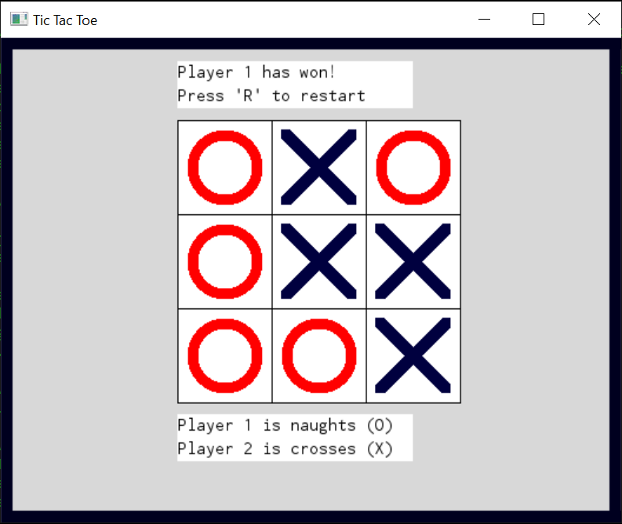

# TicTacToe-GO

**This program let's you play the classic game Tic-Tac-Toe, where two players take turns placing noughts (O's) and crosses (X's) on a 3x3 playing board, and the winner is the first player to place three of their marks in a row horizontally, vertically or diagonally.**

## About the program
The program was created with the GO programming language. The *Display* functionality was created using the *exp/shiny* libraries.

### Running the program
Before running the program, you need to install the GO programming language, as well as install the exp/shiny package. The latter can be done by running this line in the terminal:

`go install golang.org/x/exp/shiny/driver`

To run the program, navigate to the **TicTacToe-GO** folder in the terminal, and type `go run main.go`. The game should then start, and you are good to go. To quit the program, press `Ctrl+C` in the terminal, or `Esc` while in the game. 

## Content
The program has 3 modules: The `Game` module handles all data and logic associated with playing the game, the `Display` module displays the game with all its components, status and information, and `main` connects these two to let the user play the game. In particular, main runs the program by running the two goroutines `DisplayGame()` and `PlayTicTacToe()`, as well as creating channels that help these two monitor tile clicking, reset the game and update the display when needed.

## Some comments about the code
The create-functions makes an object with -2 subtracted from the height and width, and the draw-functions adds 1 to the position. This is to avoid painting over the lines that separate the tiles in the game board.

createGameBoard() has a +1 to height and width when making *gameBoardRectangle* to have all the edge lines visible.

defer *xxx*.Release() is to avoid running out of memory

The static components, such as a cross, nought and gameboard has one function for creation and one for drawing. Dynamic components has one function that does all of this as they have to be recreated regularly.